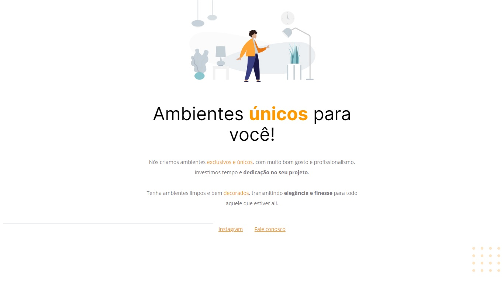

# Desafio Corrigindo bugs (02)

Desafio do Stage02 que faz parte do Programa Explorer da Rocketseat. 
Nesse desafio, você receberá um código com o projeto desenvolvido durante as aulas da Fase 02. 
E, novamente, a surpresa (não tão surpresa assim) vem aí...  👀   
O código sofreu algumas alterações nos principais pontos abordados nessa fase e, como podemos ver na imagem abaixo, ele não está mais da mesma forma que o Maykão deixou.

## Screenshots

[🔗 Clique aqui para acessar](https://fabiovascao.github.io/Projeto-02/)

## 🛠 Tecnologias

- HTML
- CSS
- Git e Github

## Autor

- [@FabioVascão](https://www.github.com/fabiovascao)